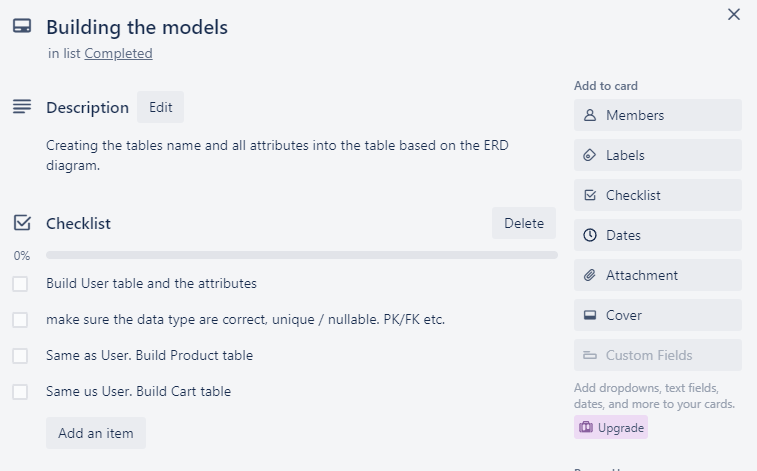
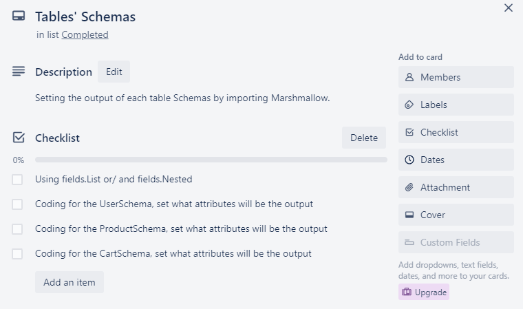

# T2A2 API Webserver Project  Wing Man SIU 13183

## R1. Identification of the problem you are trying to solve by building this particular app.

---
There are many blockers when building this app. First, the main problem should be clarified and make sure all the models are related and have no errors. 
Second is setting the authorization for the admin and user as I want to set the authorization which can let the user access their own details but no one else.

The third thing is trying to set all the errorhandler as it is so difficult to test all the possibilities that errors will occur.
The last thing is trying many different ways to fix the problem in cart_controller. As I want to let the user create a cart based on the user’s email and they can add the product inside the cart.

So, this app is selling cat products and is for the user to browse the product for the cats which includes all the details such as price, description of the product etc.. Besides, the user can register an account and login to add the product to their own cart.

## R2. Why is it a problem that needs solving?

---
For the reason why those problems need to be solved. For example, the main problem is making sure all models are related by primary key and foreign key and if the app does not let those models to relate then those tables can not be linked together and can not have any connection.

For the second problem of the authorization, if the app does not have authorization then anyone can edit or delete the data and the worst thing is anyone can access to see other users’ personal details and data.

The third problem is because error handling is meant to put the system back into a safe well defined state or halt the system before it does something silly like corrupt the database, format the hard drive, or send the president threatening emails. Undefined systems behave in undefined ways. They must be defined or stopped.

So, this app built for the user can easily browse any cat products and buy those products for their cats online. Because the user can clearly see all the details of those products on the Internet.

## R3. Why have you chosen this database system. What are the drawbacks compared to others?

---
In this app, I used PostgreSQL(PSQL) for the database and the reason for using PSQL is because it can support more different data types such as JSON, boolean etc. and PSQL is an object-relational database, this means PostgreSQL offers more complex data types and allows objects to inherit properties, but it also makes working with PostgreSQL more complex. Moreover, the security and performance are very good in PSQL as well such as the databases use indexes to speed up queries. With multiple indexing options to pick from, you can fine-tune your database performance as your data grows to get faster query responses from your database and an improved user experience for your application users. Besides, PSQL supports user and group management and granting SQL privileges to roles and supports IP-based client filtering and authentication using PAM and Kerberos.

## R4. Identify and discuss the key functionalities and benefits of an ORM

---
Object-relational mapping (ORM) is a mechanism that makes it possible to address, access and manipulate objects without having to consider how those objects relate to their data sources. The ORM library can execute the exact same query as using the SQL database and ORM can let other coding languages such as JavaScript or Python etc.  to edit the database. Because of that, anyone can easily write the code as it abstracts away the database system and makes many of the queries better than by writing it by yourself.

## R5. Document all endpoints for your API

---
User’s endpoint  :  <https://documenter.getpostman.com/view/24313592/2s8YeivvRV>

Product endpoint : <https://documenter.getpostman.com/view/24313592/2s8YeivvRW>

Cart endpoint : <https://documenter.getpostman.com/view/24313592/2s8YeivvVn>

## R6. ERD of Cat Shop

---

## R8. SQLAlchemy model and Marshmallow schemas

---
In my app SQLAlchemy is very important as it can represent as a database and make sure all the data or information can create, add, update and delete to the database. Moreover, SQLAlchemy can also make the admin easily search the data or tables in the database.
In the Marshmallow Schemas, it can import the field to determine which attributes in each table will show into the endpoint.

For example, this picture shows UserSchema can input other tables’ schema and choose which attributes will be output. `fields.Nested` means can input another schema to the current schema. And `fields.List` means those schema will show all of the attributes as a list.

## R9. ERD relationships, table, columns, relationships, PK/FK etc

---

In the Cat Shop’s database, there are three main tables which are carts, products and users.

First, in the users table, there are seven attributes. ’Id’ is the primary key for the users and it is not nullable which means it must be provided. And then ‘name’ is not nullable as well and the user can put down their name. ‘email’ is not nullable and you can see in the index that showed ‘UNIQUE CONSTRAINT’ which means one email can only register once and each email is unique because it is for the user to login. ‘password’ is not nullable and when ‘password’ is created, it will generate the hash and hide it for security reasons, when login it will generate a token as a pass to access. ‘address’ is not nullable as the app may provide delivery in the future, so that is the reason why I need the user to provide an address. ‘phone’ is nullable so the user can ignore providing the phone number, it is optional but only can input integers. ‘admin’ is a boolean and set for the user who can have authorization to edit , delete and access more details. Moreover, you can see the referenced by: , there are two tables related to users table which are carts table and products table by using user(id) to be the foreign key.

The second is the products table, it is similar to the users table such as there is ‘Id’ as a primary key and some of the attributes are not nullable which are ‘id’, ‘categories’, ‘name’ and ‘price’. Moreover, there is one attribute that is optional which is ‘description’. For the ‘status’ attribute which is optional to input but I set the default is ‘In stock’ which means if the admin does not input the status, it will show the status is ‘in stock’ for default. Also, user_id is a foreign key from the users table for connecting and building a relationship with two tables. And the last thing is the products table related to the carts table by using products(id).

The third table is the carts table, there is ‘id’ as a primary key for this table and ‘cart_created_date’ is for recording when the cart has been created. In this table ‘user_id’ and ‘product_id’ are representing and from the tables of ‘users’ and ‘products’. And ‘user_id’ is not nullable because the cart is created for the user to add the product inside, so if no user id is recognized then the cart cannot be created. And the ‘product_id’ is for the user to add the product by using ‘product_id’ to the cart.

## R10. Describe the way tasks are allocated and tracked in your project

---
First, the app needs to have an ERD diagram to follow by.

After the ERD approved, the first thing to do is setting the database and there are some checklists to follow. Because those checklists are so important and are easily to infect the database setting such as how to create a user in database and set the authorization for the account by using `grant all privileges....` etc. After that, the app needs to import different pip packages and set the `app.config` for SQLAlchemy. Those lists are mainly focus on to track and make sure the app can functioning at the beginning.

Besides, now the app can start to create the files for each tables based on ERD diagram. In each files which called models, there are User, Product and Cart models. Therefore, each model has own attributes which are different such as some of them may `unique`, `nullable` or different data types such as `string`, `integers` etc. Moreover, those models have relationships so needs to make sure their primary key and foreign key are related and functioning well. This is the main tracking tasks for the models.

After finished the basic models defining. The app can try to put those models into the database by using SQLAlchemy. First, needs to make sure the file is blueprint-ed and can start coding, for example `command('create')` for create each tables and `command('drop')` for delete all tables etc. The most important part in here is `seed` which is trying to put some random data into the database and check is the database and all the coding are correct and no errors.

Of course, at the same time, the app must has a main file to execute the whole app. In the `main.py`, we need to make sure all of the files are connected to this file and can be functioning. So there is a lot of import to do and for some of the files which are using blueprint, we need to code `app.register_blueprint` for making sure those files can be execute in HTTP or database. Especially using `init_app` to put each app into this file. Also, we can do the error handlers here to make those become global for suit to each files.

In each table, we need to code the schema to show the structure or choose specific attributes that we want to display. For example, we can import `fields` to do the `fields.List` or `fields.Nested` to determine the structure such as showing as list or the specific attributes by using `exclude=['user']` or `only=['name']` etc.

First, we will design the routing for User model. First, we need to do the definition for the authorization as some of the data should hide for other people to access such as all users' personal information. Besides, we will have four routes to do. First, we code a route for the admin can access all the users' personal information. Then, the second route is for the user who can access their own personal information only. The third route is for the new user to register and there are some requirements that the user must provide for the registration such as `('name', 'password', 'email', etc.)`. And the final route is for the user to login and get the secret token to get the authorization to access other routes.

The Product table has five routes and needs the authorization as well but we can import the User's one. The first route is showing all the product details to the viewers, not only for the users so they can still access without login or register the account. The second route is for the viewers can specific to browse each product and see the detail. The third route is only for the admin because this route can delete any products, so the admin must provide the secret token to get the authorization to do this action. Moreover, thr fourth route is also for the admin only as this route can update any details in each product. The final route is also for the admin to create a new product and there are some fixed attributes that the admin must provide such as `('name', 'categories', 'price')`.

The final one is Cart table. There are five routes as well and the first route is for the admin to see all of the carts details. And the second route is the user can use their own secret token to check their carts and what products already added into the cart. The third route is for the user to create a new cart and put the product into the cart. The fourth route is for the user to check the specific cart and what products inside the cart. As the final route is for the user to delete the cart by using the specific cart number. So the user can check the specific cart first and see which one the user wants to delete.

At the end, all of the routing are difficult to track as there are many different possibilities to occur errors, and we need to check and test those in different ways and try to fix all of them.
